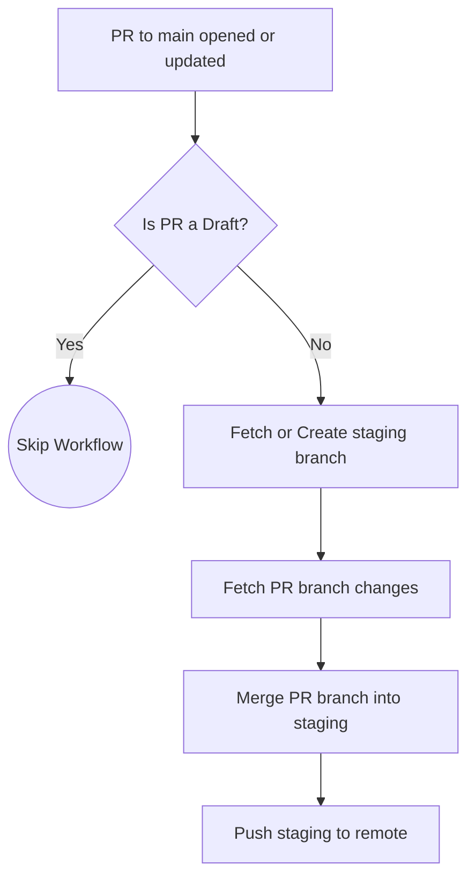
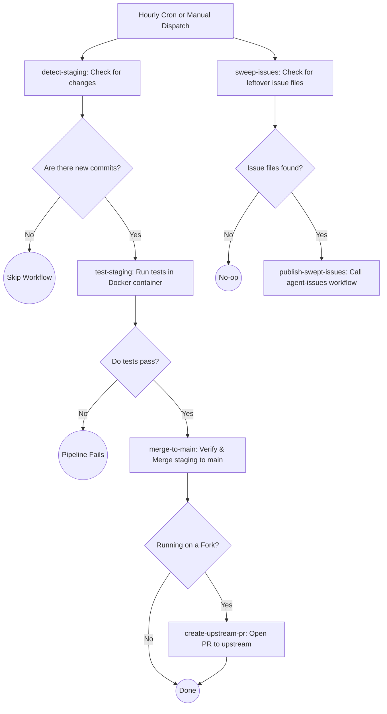
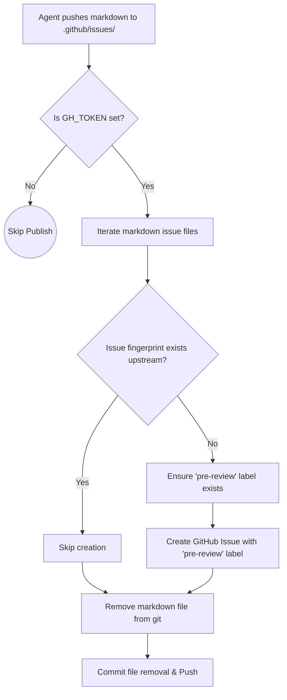
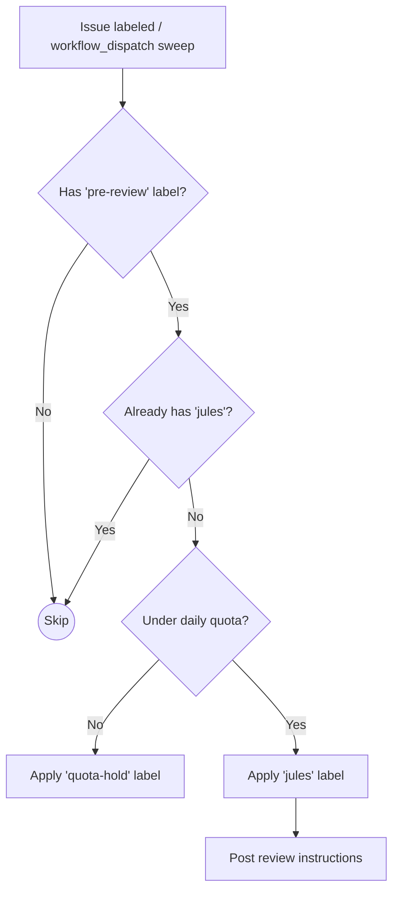
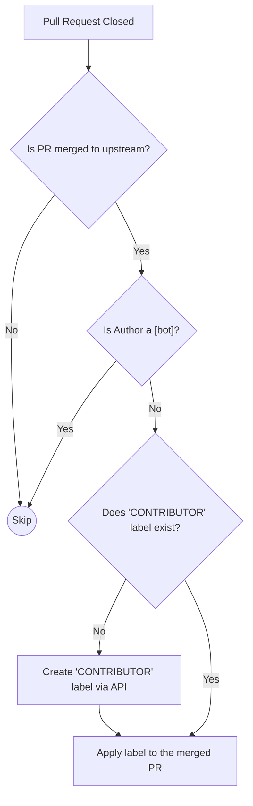

# Continuous Integration & Delivery (CI/CD)

This document outlines the automated pipelines that power the development lifecycle of this project. All automation is handled via GitHub Actions and can be found in the `[.github/workflows](../.github/workflows)` directory.

## Workflows Overview

### 1. Auto-merge PR to Staging
**Trigger:** `pull_request_target` (opened, synchronize, reopened, ready_for_review) against `main`.
**File:** `auto-merge-staging.yml`

This workflow enforces an "open-by-default" staging environment. Whenever a non-draft Pull Request is opened against the `main` branch, it is automatically merged into the `staging` branch so that it can be tested in an integrated environment.

### 2. Hourly Merge to Main
**Trigger:** `schedule` (cron) or `workflow_dispatch`.
**File:** `hourly-merge-main.yml`

This scheduled job acts as the gatekeeper to production (`main`). It periodically checks the `staging` branch, runs all automated tests, and if everything passes cleanly, promotes staging into `main`. It also sweeps for any leftover issue files on `main` and publishes them.

### 3. Publish Agent Issues
**Trigger:** `push` modifying `.github/issues/*.md`, `workflow_call`, or `workflow_dispatch`.
**File:** `agent-issues.yml`

This workflow handles automated issue generation by AI agents. When markdown files are pushed to `.github/issues/`, this action parses them, translates them into actual GitHub Issues on the upstream repository, and applies the `pre-review` label to signal that the issue needs triage.

### 4. Jules Issue Reviewer
**Trigger:** `issues` (labeled) or `workflow_dispatch`.
**File:** `jules-issue-reviewer.yml`

When an issue is labeled with `pre-review`, this workflow checks the rolling 24h quota (`JULES_DAILY_TASKS` repo variable) and, if slots remain, applies the `jules` label and posts review instructions. Over-quota issues receive a `quota-hold` label and are retried automatically by the hourly sweep.

### 5. Label Contributors
**Trigger:** `pull_request` (closed).
**File:** `add-contributors.yml`

A community management workflow that ensures everyone who successfully merges code gets recognized. When a PR is merged, the author automatically receives the `CONTRIBUTOR` label (unless they are a bot).

---

## Issue Lifecycle

All agent-generated issues follow a label-driven state machine. Labels are created automatically by workflows if they do not already exist. Issue throughput is governed by the `JULES_DAILY_TASKS` repository variable (rolling 24h window).

```mermaid
stateDiagram-v2
    [*] --> pre_review : Agent creates issue
    pre_review --> jules : Under quota — reviewer assigns
    pre_review --> quota_hold : Over quota — held for retry
    quota_hold --> jules : Hourly sweep retries
    jules --> reviewed : Jules completes review
    reviewed --> ready_for_work : Final approval
    ready_for_work --> [*] : Work begins

    pre_review : 🟡 pre-review
    quota_hold : ⏳ quota-hold
    jules : 🟣 jules
    reviewed : 🟢 reviewed
    ready_for_work : 🔵 ready for work
```

